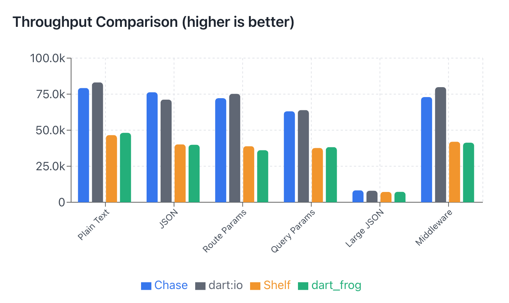

# Benchmarks

chase is fast. You can see it in the results below.

## Dart Web Frameworks

Comparison with other Dart web frameworks on the same machine.

### Frameworks Compared

| Framework | Description |
|-----------|-------------|
| **chase** | Trie-based router, minimal overhead |
| **shelf** | Dart team's official web server middleware |
| **dart_frog** | VGV's full-stack Dart framework |
| **dart:io** | Raw HttpServer (baseline) |

### Results

<p align="center">
  
</p>

| Test | chase | dart:io | Shelf | Dart Frog | chase vs dart:io |
|------|-------|---------|-------|-----------|------------------|
| Plain Text | 72,187 | 72,391 | 42,206 | 41,006 | 99.7% |
| JSON | 66,233 | 68,908 | 38,863 | 38,135 | 96.1% |
| Route Params | 65,681 | 60,256 | 36,721 | 36,695 | 109% |
| Query Params | 63,154 | 65,237 | 36,534 | 35,483 | 96.8% |
| Large JSON | 8,053 | 8,110 | 7,812 | 7,643 | 99.3% |
| Middleware | 63,308 | 71,117 | 37,937 | 37,093 | 89.0% |

> Tested on Apple M4, Dart 3.10, JIT mode, 100 concurrent connections, 10 seconds duration.

### Endpoints Tested

| Test | Endpoint | Description |
|------|----------|-------------|
| **Plain Text** | `GET /` | Simple "Hello, World!" response |
| **JSON** | `GET /json` | JSON object serialization |
| **Route Params** | `GET /user/:id` | Dynamic route parameter extraction |
| **Query Params** | `GET /query?name=x&age=y` | URL query string parsing |
| **Large JSON** | `GET /large` | 100-item array serialization |
| **Middleware** | `GET /middleware` | 3-layer middleware chain |

## Why is chase fast?

### Trie-based Router

chase uses a trie-based router for O(k) route matching, where k is the path depth. This is significantly faster than linear route matching used by some frameworks.

```
Routes registered:
  /users
  /users/:id
  /users/:id/posts
  /users/:id/posts/:postId

Matching /users/123/posts/456:
  Trie:   O(4) - traverse 4 nodes
  Linear: O(n) - check all routes until match
```

### Minimal Abstraction

chase keeps abstractions minimal. Request handling flows directly from the router to your handler with minimal intermediate processing.

### AOT Compilation

Dart's AOT compilation produces native executables with:
- Instant startup (no JIT warmup)
- Lower memory footprint
- Consistent performance

## Run Your Own Benchmarks

```bash
cd benchmark
./run.sh --aot
```

See [benchmark/](https://github.com/user/chase/tree/main/benchmark) for the full benchmark suite.

## Methodology

- **Tool**: wrk or hey
- **Duration**: 10 seconds per test
- **Connections**: 100 concurrent
- **Threads**: 4
- **Mode**: AOT compiled (`dart compile exe`)

All frameworks implement identical endpoints to ensure fair comparison.
